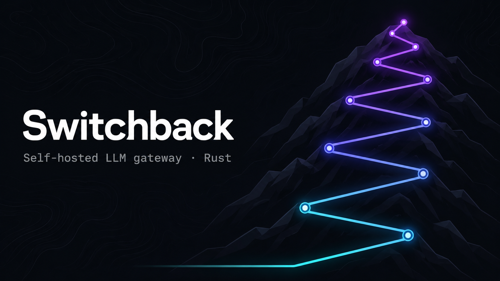

[](https://github.com/umutkeltek/switchback/actions/workflows/ci.yml)
[](LICENSE)
[](rust-toolchain.toml)

# Switchback

**A self-hosted AI execution gateway for teams.** One Rust binary that sits in
front of your AI providers and gives you **provider routing, credential control,
budgets, usage, fallback, and audit — without changing client code.**

Point your existing OpenAI- or Anthropic-compatible client at Switchback and it
keeps working, but now it's multi-provider, multi-account, observable, and
cost-aware:

```bash
# your app, unchanged — just a different base URL
curl localhost:8765/v1/chat/completions -H 'content-type: application/json' \
  -d '{"model":"openrouter/anthropic/claude-3.5-sonnet","messages":[{"role":"user","content":"hi"}]}'
```

It receives the call (OpenAI/Anthropic HTTP), normalizes it into one canonical
typed format, routes it across providers/accounts with an **explainable decision**
and **fallback**, and streams the response back in the client's own wire format.

> **Name:** *switchback* — a road that keeps climbing by re-routing. Switching + resilience.

## Quickstart (60 seconds, no API keys)

```bash
# zero-setup mock config — serves immediately
cargo run -p sb-server -- serve --config config/quickstart.yaml      # or: docker run -p 8765:8765 ghcr.io/umutkeltek/switchback:latest

curl -s localhost:8765/health
curl -s localhost:8765/v1/chat/completions -H 'content-type: application/json' \
  -d '{"model":"mock/echo","messages":[{"role":"user","content":"hi"}]}'
open http://localhost:8765/        # the embedded dashboard
```

→ Full 5-minute walkthrough (tenant key, routing, fallback, cost cap, traces):
**[`QUICKSTART.md`](QUICKSTART.md)**. Deploying for a team: **[`OPERATIONS.md`](OPERATIONS.md)**.

## Add a provider — it's config, not code

```yaml
# switchback.yaml — an OpenAI-shaped provider is pure config
providers:
  - id: openrouter
    type: openai_compatible
    base_url: "https://openrouter.ai/api/v1"
    accounts:
      - { id: main, auth: { kind: api_key, key_env: OPENROUTER_API_KEY } }
```

`switchback provider add openrouter --config switchback.yaml` scaffolds it for
you. Presets exist for `openai`, `openrouter`, `anthropic`, `gemini`, `deepseek`,
`groq`, `mistral`, `together`, `fireworks`, `cerebras`, `xai`, `nvidia`, `ollama`,
`vllm`. Real recipes: [`PROVIDER_SETUP.md`](PROVIDER_SETUP.md).

## What you get

- **One hub, many wire formats** — OpenAI Chat & Responses, Anthropic Messages,
  Gemini/Vertex, AWS Bedrock (SigV4 + event-stream); stream and non-stream.
- **Explainable routing + two-level fallback** — every request emits a
  `RouteDecision`; fall over across accounts within a provider, then across providers.
- **Cost-, latency-, health-, and policy-aware ordering** — cheapest or fastest
  healthy host, price ceilings, lane gates, TTFT-vs-total latency split.
- **Multi-account auth** — fill-first/round-robin, per-`(account,model)` lockouts,
  an **age-encrypted vault** (key in the OS keychain), de-duplicated OAuth refresh.
- **Budgets & quotas** — global/per-provider spend caps; per-tenant `budget_usd`
  (→ 402) and `max_concurrency` (→ 429), enforced before upstream dispatch.
- **Observability** — metadata-only traces (decision + every attempt + cost), an
  append-only usage ledger, request-id headers, optional OpenTelemetry export.
- **Control plane** — redacted config API, live runtime knobs, atomic hot-reload
  with per-request revision pinning, a declarative `/cp/v1` (draft→validate→publish),
  and an embedded dashboard at `/`.
- **Provider certification** — `provider certify` / `matrix` runs a live readiness
  smoke so you know which providers are actually up *before* routing production traffic.
- **Resilience** — same-target retry, per-provider circuit breaker, request hedging.
- **Egress control** — route an account through a named HTTP(S)/SOCKS5 proxy path.
- **Plugins** — trusted built-ins (`model_blocklist` / `request_tag` / `egress_pin`)
  on the hot path, plus optional sandboxed Wasm (`--features wasm`).
- **Durable state (opt-in)** — point `server.state_store` at a SQLite file for
  config revisions, an audit log, and usage that survive restarts.

The full capability reference and the crate-by-crate design live in
**[`ARCHITECTURE.md`](ARCHITECTURE.md)**.

## What it is — and isn't (yet)

Switchback is a **single-binary team gateway**, built so it *can* grow toward
hosted scale without a rewrite. The hosted machinery is intentionally not built —
be honest about these before you lean on them:

- **Single-host coordination, not a hosted cluster.** The durable store is SQLite
  — great for local/single-host/team use and for nodes sharing one SQLite file on
  a shared filesystem. It is **not** a hosted multi-node cluster backend (that's
  Postgres + Redis/etcd territory).
- **Usage is internal accounting, not billing infrastructure.** You get accurate
  cost attribution + a `billing_grade` honesty flag — **not** provider-invoice
  reconciliation, pricing-version snapshots, or external audit export.
- **Tenancy is gateway-level isolation, not hosted multi-tenant SaaS.** API-key →
  tenant scoping, restrictions, quotas, and per-tenant views are real; there's
  **no** org/user hierarchy, row-level store filtering, per-tenant secrets, or SSO.

## Install

```bash
# from source (stable Rust, pinned via rust-toolchain.toml)
git clone https://github.com/umutkeltek/switchback && cd switchback
cargo build --release          # binary at target/release/switchback

# or Docker (multi-arch image on every release)
docker run --rm -p 8765:8765 ghcr.io/umutkeltek/switchback:latest
```

Prebuilt binaries (linux/macOS/windows, x86_64 + aarch64, with checksums) are on
the [Releases](https://github.com/umutkeltek/switchback/releases) page.

> **Security note.** On loopback (`127.0.0.1`) with no key set, the gateway runs
> open — fine locally. A non-loopback bind (`0.0.0.0`) **refuses to start**
> unless you set `server.api_key`/`api_keys` or explicitly opt into
> `server.allow_open_admin: true`. Once a key is set, every endpoint except `/`
> and `/health` requires it. See [`SECURITY.md`](SECURITY.md).

## Docs

| Doc | What |
|---|---|
| [`QUICKSTART.md`](QUICKSTART.md) | 5-minute hands-on walkthrough |
| [`OPERATIONS.md`](OPERATIONS.md) | Deploying for a team (Docker Compose, backups, auth) |
| [`ARCHITECTURE.md`](ARCHITECTURE.md) | Crate-by-crate design + full capability reference |
| [`CLI.md`](CLI.md) | The operator & agent-facing CLI contract |
| [`PROVIDER_SETUP.md`](PROVIDER_SETUP.md) | Real provider recipes |
| [`SECURITY.md`](SECURITY.md) | Security model + how to report a vulnerability |
| [`AGENTS.md`](AGENTS.md) | Invariants, conventions, contribution recipes |

## Status

`v0.1.0` — the v1 surface (data plane, routing, multi-account, observability,
egress, control plane), the extracted execution runtime (`sb-runtime`, atomic
hot-reload + per-request revision pinning), and durable state (`sb-store`) are
built and tested. The scope and the deliberately-out-of-scope hosted machinery
are detailed in [`ARCHITECTURE.md`](ARCHITECTURE.md) and [`AGENTS.md`](AGENTS.md).

## Contributing

Read [`AGENTS.md`](AGENTS.md) (architecture + invariants) and
[`CONTRIBUTING.md`](CONTRIBUTING.md) (workflow + the verification bar) before
opening a PR. The short version: keep the crate graph acyclic, keep `sb-core`
provider-agnostic, every request emits a `RouteDecision`, no secrets in logs, and
claims need tool evidence (`cargo build && cargo test`, clippy clean, a `curl`
smoke for request-path changes). Found a vulnerability? See
[`SECURITY.md`](SECURITY.md) — report it privately.

## License

Source-available under the [Elastic License 2.0](LICENSE) (ELv2). You can use,
copy, modify, and self-host it; you may not offer it to third parties as a
hosted/managed service or remove the licensing notices.
