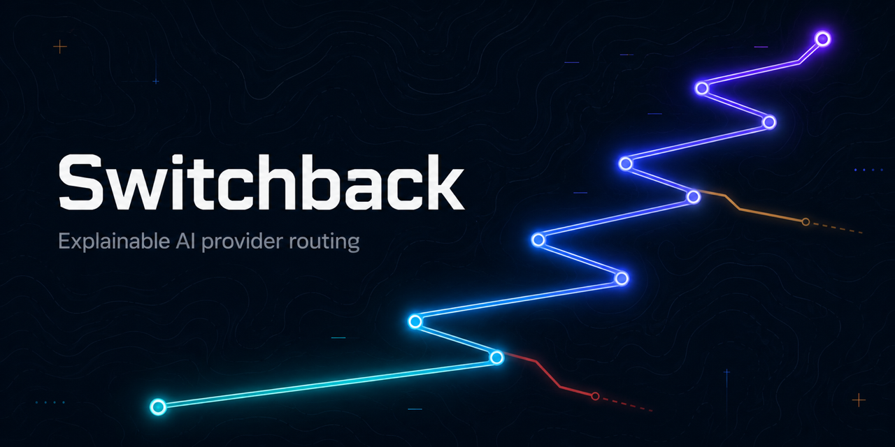

# Switchback

[](https://github.com/umutkeltek/switchback/actions/workflows/ci.yml)
[](LICENSE)
[](https://github.com/umutkeltek/switchback/releases)
[](https://github.com/umutkeltek/switchback/pkgs/container/switchback)

**One Rust binary for explainable AI provider routing.**

Switchback is a **self-hosted AI gateway** for teams running LLM traffic across
multiple providers and accounts. Point your existing OpenAI- or
Anthropic-compatible clients at it and keep your app code unchanged.

It normalizes each request into a typed canonical IR, picks a provider + account
using policy, health, cost, latency, quotas, and credential availability, then
returns the response in the caller's original wire format. **Every request emits
an inspectable `RouteDecision`** — selected target, rejected candidates with
reasons, fallback order, scores, and a trace id.

```bash
# same client, different base URL — no code change
SWITCHBACK_BASE_URL="http://${SWITCHBACK_HOST:-localhost}:${SWITCHBACK_PORT:-8765}"
curl "${SWITCHBACK_BASE_URL%/}/v1/chat/completions" \
  -H 'content-type: application/json' \
  -d '{"model":"mock/echo","messages":[{"role":"user","content":"hi"}]}'
```

Reach for Switchback when you need provider choice, credential control, budgets,
fallback, and metadata-only observability **without** buying a hosted AI gateway
or running a Python proxy.

## Quickstart (60 seconds, no API keys)

```bash
# zero-setup mock config — serves immediately
cargo run -p sb-server -- serve --config config/quickstart.yaml      # or: docker run -p 8765:8765 ghcr.io/umutkeltek/switchback:latest

SWITCHBACK_BASE_URL="http://${SWITCHBACK_HOST:-localhost}:${SWITCHBACK_PORT:-8765}"
curl -s "${SWITCHBACK_BASE_URL%/}/health"
curl -s "${SWITCHBACK_BASE_URL%/}/v1/chat/completions" -H 'content-type: application/json' \
  -d '{"model":"mock/echo","messages":[{"role":"user","content":"hi"}]}'
open "${SWITCHBACK_BASE_URL%/}/"        # the embedded dashboard
```

→ Full 5-minute walkthrough (tenant key, routing, fallback, cost cap, traces):
**[`QUICKSTART.md`](QUICKSTART.md)**. Deploying for a team: **[`OPERATIONS.md`](OPERATIONS.md)**.

## Point Claude Code / Codex at any provider (3 steps)

```bash
./cli/install.sh
sb connect zai --alias claudex
claudex
```
Keep the self-hosted gateway; swap the provider. See [CLI setup and custom-provider examples](cli/README.md#5-minute-quickstart).

## Native coding clients

Codex can use Switchback through the OpenAI Responses surface
(`/v1/responses`), and Claude Code can use it through the Anthropic Messages
surface (`/v1/messages` plus `/v1/messages/count_tokens`). The client auth files
do not become the source of truth: provider credentials and account selection
stay in Switchback config/vault/tenants. `GET /v1/client-profiles` reports the
active Codex and Claude Code readiness, endpoint shape, visible models, and
non-secret account sources for operators and LLMs.

Set `SWITCHBACK_BASE_URL` to the origin where clients can reach the gateway;
generated native-client next commands trim any trailing slash before appending
their protocol path.

```bash
switchback init --native-clients --config switchback.yaml
switchback serve --config switchback.yaml
: "${SWITCHBACK_BASE_URL:?set SWITCHBACK_BASE_URL to your Switchback origin}"
open "${SWITCHBACK_BASE_URL%/}/"
```

The native-client starter runs immediately on `mock/echo`, with explicit
`codex` and `claude-code` profiles you can later repoint to real
OpenAI/Anthropic provider accounts. Native token-source adapters are available
as explicit account auth: `kind: codex_oauth` reads `CODEX_ACCESS_TOKEN` or
`${HOME}/.codex/auth.json`; `kind: claude_code_oauth` reads
`CLAUDE_CODE_OAUTH_TOKEN` or `claudeAiOauth.accessToken` from
`${HOME}/.claude/.credentials.json`. These are direct token-source adapters, not
first-party subscription relay. For any client-managed rotating JSON credential
file, `kind: json_token` takes an explicit `token_file` and
`access_token_pointer`, then re-reads that pointer for every credential lease
without copying the token into Switchback config. The planned relay provider kinds
(`codex_native_relay`, `claude_code_native_relay`) fail closed until audited
native wire fixtures and adapters exist.

## OMP headless profile invocation

Generated OMP profile wrappers accept prompt text, or the bounded executor form

```sh
my-omp-profile -p --no-session --cwd /path/to/workspace --no-tools 'Review this text'
```

`--no-tools` is optional and only reduces the tool surface. RPC and arbitrary
native CLI flags are rejected, never folded into the prompt or allowed to override
the profile's route and always-ask posture. Use `my-omp-profile -- '--literal prompt'`
for prompt text beginning with a dash. The wrapper terminates option parsing before
passing the prompt to OMP.

Each invocation creates its own private temporary agent home, copying only the
owner-generated `models.yml`. Stored profile auth, settings, sessions, and inherited
`OMP_PROFILE` cannot select shared runtime state. The source profile remains intact.
The wrapper removes its temporary home on exit and catchable termination; SIGKILL
cannot run cleanup traps. The supervising executor still owns deadlines, process-group
termination, execution receipts, and orphan recovery. Profile conformance describes
this boundary; it is not inference success or proof of a native policy-denial hook.

Subprocess regressions live in the server **library** target:

```sh
cargo test -p sb-server --lib direct_headless_harness_tests
```

They execute the generated wrapper with a local stub, a cleared environment, and
disabled user shell startup. No installed OMP binary or provider account is needed.

## Switchback-owned runtime data

The CLI keeps operational data in one runtime root owned by Switchback. In a
repository checkout this is `.switchback/`; standalone installs can choose a
different root with `SWITCHBACK_RUNTIME_ROOT` or `--root`:

```bash
switchback setup                         # initialize .switchback safely
switchback paths --json                  # inspect the complete layout
switchback serve                         # uses .switchback/config/switchback.yaml
```

Plan safety-sensitive setup changes before applying them:

```bash
switchback setup migrate --from-current --dry-run
switchback setup launch-agent --plan
```

The runtime contains local config, provider lanes, capture indexes, traces,
usage, evaluations, receipts, and installation artifacts. Existing files are
kept; setup never overwrites secrets or capture evidence. Native client trees
such as `~/.codex`, `~/.claude`, and `~/.headroom` remain external references,
not data silently claimed by Switchback. `~/.config/switchback` is supported as
a compatibility link by the installer.

Capture spool drain preserves accepted remote custody when it relocates a sealed
segment into the archive. Reclaim planning recovers historical spool locations only
from the exact sealed index projection and matching segment and manifest checksums.
It never treats a missing file as permission to discard backup proof.
Confirmed spool drains use the maintenance writer timeout and acquire an immediate
index transaction before changing a segment projection, so live capture writers
cannot turn a deferred lock upgrade into an avoidable partial-batch failure.

Legacy migration copies only with `--apply`, preserves every source, skips
destination conflicts, and writes a receipt. The installer records the exact
engine version, commit, path, and SHA-256 in
`.switchback/bin/install-provenance.json`. LaunchAgent apply backs up a
different plist but never loads or restarts the service.

An OpenAI-shaped provider is pure config; a non-bearer one is also config.

```yaml
# switchback.yaml
providers:
  - id: openrouter
    type: openai_compatible
    base_url: "https://openrouter.ai/api/v1"
    accounts:
      - { id: main, auth: { kind: api_key, key_env: OPENROUTER_API_KEY } }
routes:
  - name: default
    match: { model: "*" }
    targets: ["openrouter/anthropic/claude-3.5-sonnet", "anthropic/claude-3.5-sonnet"]
```

```bash
switchback provider add openrouter --config switchback.yaml   # scaffolds the above
switchback route-preview --config switchback.yaml --model default --json   # see the decision before serving
switchback provider certify --config switchback.yaml          # is the provider actually live?
```

Presets exist for `openai`, `openrouter`, `anthropic`, `gemini`, `deepseek`,
`groq`, `mistral`, `together`, `fireworks`, `cerebras`, `xai`, `nvidia`,
`ollama`, `vllm`. Real recipes: [`PROVIDER_SETUP.md`](PROVIDER_SETUP.md).

## See the decision

`route-preview` (and every response's `x-switchback-route` header) returns the
actual decision — not a black box:

```json
{
  "request_id": "req_2a69eea4750c472c",
  "strategy": "ordered_fallback",
  "selected":  { "target_id": "openrouter/anthropic/claude-3.5-sonnet" },
  "fallbacks": [
    { "target_id": "anthropic/claude-3.5-sonnet" }
  ],
  "rejected": [
    { "target_id": "openai/gpt-4o",        "reason": "blended price over max_price ceiling" },
    { "target_id": "bedrock/claude-sonnet", "reason": "no healthy accounts" }
  ],
  "reason": ["route=default", "stream_required=true", "tools_required=false"],
  "unverified": false
}
```

Each candidate also carries a `scores` block (cost / latency / ttft / health /
account_availability …) so the ordering is auditable.

## What you get

- **Route across providers and accounts** — OpenAI Chat & Responses, Anthropic
  Messages, Gemini/Vertex, AWS Bedrock; stream and non-stream; two-level fallback
  (accounts within a provider, then across providers).
- **Explain every decision** — every request emits a `RouteDecision`; fallback is
  legal only *before the first streamed byte*.
- **Control credentials locally** — mixed account auth (API key, OAuth refresh,
  native Codex/Claude Code OAuth tokens, service account, SigV4),
  fill-first/round-robin selection, per-account lockouts,
  an **age-encrypted vault** (key in the OS keychain), de-duplicated OAuth refresh.
- **Enforce budgets and quotas** — global/per-provider spend caps; per-tenant
  `budget_usd` (→ 402) and `max_concurrency` (→ 429), rejected before dispatch.
- **Trace without storing prompts** — metadata-only traces, durable session
  rollups, route replay diffs, and an append-only usage ledger; optional
  OpenTelemetry/Langfuse export.
- **Observe response quality safely** — opt-in live-traffic sampling judges
  bounded text through an allowlisted internal route, persists metadata-only
  scores, survives restart, and ships observation-only until a routing weight
  is deliberately enabled.
- **Operate safely** — provider certification, hot-reload with revision pinning,
  circuit breaker, admission control, and an embedded dashboard at `/`.

More — egress proxies, RTK tool-result compression, schema downleveling, the
declarative `/cp/v1` control plane, two-tier (Rust + Wasm) plugins, durable
SQLite state — is in **[`ARCHITECTURE.md`](ARCHITECTURE.md)**.

## Why Switchback?

| You need | Switchback's bias |
|---|---|
| A self-hosted team gateway | One Rust binary; no hosted dependency, no Python runtime |
| Existing clients to keep working | OpenAI/Anthropic-compatible ingress; no app rewrite |
| Provider/account control | Local age-encrypted vault + per-account fallback |
| Debuggable routing | Every request emits an inspectable `RouteDecision` |
| Confidence before cutover | `provider certify` checks a provider is live first |
| Observability without prompt risk | Metadata-only traces, sessions, replay diffs, Langfuse/OTel, and usage |

## Compatibility

| Surface | Status |
|---|---|
| OpenAI Chat Completions / Responses | supported |
| Anthropic Messages (+ count_tokens) | supported |
| Gemini / Vertex | supported |
| AWS Bedrock (SigV4 + event-stream) | supported |
| Streaming (SSE) | supported, one code path |
| Tools / structured output | client function tools supported; server tools are protocol-gated; schema limits are provider-specific |
| Multimodal | image input supported where the target declares vision; audio/video/file input and generated media remain limited/fail-loud |

## What it is — and isn't (yet)

Switchback is a **single-binary team gateway**, built so it *can* grow toward
hosted scale without a rewrite. The hosted machinery is intentionally not built:

- **Single-host coordination, not a hosted cluster.** The durable store is SQLite
  (WAL) — great for local and single-host/team use. Cross-process coordination on
  a shared SQLite file is possible only where filesystem locking is known and
  tested; it is **not** a hosted multi-node cluster backend (that's Postgres +
  Redis/etcd territory).
- **Usage is internal accounting, not billing.** Accurate cost attribution + a
  `billing_grade` honesty flag — **not** provider-invoice reconciliation,
  pricing-version snapshots, or external audit export.
- **Tenancy is gateway-level isolation, not multi-tenant SaaS.** API-key → tenant
  scoping, restrictions, quotas, and per-tenant views are real; there's **no**
  org/user hierarchy, row-level store filtering, per-tenant secrets, or SSO.

## Install

```bash
# from source (stable Rust, pinned via rust-toolchain.toml)
git clone https://github.com/umutkeltek/switchback && cd switchback
cargo build --release -p sb-server          # binary at target/release/switchback
./target/release/switchback setup              # initialize the owned .switchback root

# or Docker (multi-arch image on every release)
docker run --rm -p 8765:8765 ghcr.io/umutkeltek/switchback:latest
```

Prebuilt binaries (linux/macOS/windows, x86_64 + aarch64, with checksums) are on
the [Releases](https://github.com/umutkeltek/switchback/releases) page.

> **Security.** On loopback (`127.0.0.1`) with no key set, the gateway runs open —
> fine locally. A non-loopback bind (`0.0.0.0`) **refuses to start** unless you
> set `server.api_key`/`api_keys` or explicitly opt into
> `server.allow_open_admin: true`. Once a key is set, every endpoint except `/`
> and `/health` requires it. See [`SECURITY.md`](SECURITY.md).

## Docs

| Doc | What |
|---|---|
| [`QUICKSTART.md`](QUICKSTART.md) | 5-minute hands-on walkthrough |
| [`OPERATIONS.md`](OPERATIONS.md) | Deploying for a team (Docker Compose, backups, auth) |
| [`ARCHITECTURE.md`](ARCHITECTURE.md) | Crate-by-crate design + full capability reference |
| [`CLI.md`](CLI.md) | The operator & agent-facing CLI contract |
| [`PROVIDER_SETUP.md`](PROVIDER_SETUP.md) | Real provider recipes |
| [`MULTIMODAL_WORKLOAD_BRIEF.md`](MULTIMODAL_WORKLOAD_BRIEF.md) | Design direction for image/video/workflow workload planes |
| [`DASHBOARD_DESIGN_RECAP.md`](DASHBOARD_DESIGN_RECAP.md) | Operator-console redesign direction for setup, lanes, and future jobs |
| [`SECURITY.md`](SECURITY.md) | Security model + how to report a vulnerability |
| [`AGENTS.md`](AGENTS.md) | Invariants, conventions, contribution recipes |

## Status

`v0.1.0` is an early **source-available** release. The core is in place and
tested: the data plane, the routing engine, multi-account credentials,
metadata-only traces, hot-reload with revision pinning, and optional SQLite
state for usage/traces/control metadata. APIs and config may change before
`v1.0` — data-plane compatibility is the
priority. The intended scope is a single-binary **team** gateway, not a hosted
multi-tenant SaaS or a billing platform. Full scope: [`ARCHITECTURE.md`](ARCHITECTURE.md).

## Why "Switchback"?

A switchback is a mountain road that keeps climbing by re-routing. That's the
design goal: resilient routing that never loses control of where a request went,
what it cost, and why.

## Contributing

Read [`AGENTS.md`](AGENTS.md) (architecture + invariants) and
[`CONTRIBUTING.md`](CONTRIBUTING.md) (workflow + the verification bar) before
opening a PR. The short version: keep the crate graph acyclic, keep `sb-core`
provider-agnostic, every request emits a `RouteDecision`, no secrets in logs, and
claims need tool evidence (`cargo build && cargo test`, clippy clean, a `curl`
smoke for request-path changes). Found a vulnerability? See
[`SECURITY.md`](SECURITY.md) — report it privately.

## License

Source-available under the [Elastic License 2.0](LICENSE) (ELv2) — use, copy,
modify, and self-host it; you may not offer it to third parties as a
hosted/managed service or remove the licensing notices. ELv2 is source-available,
not an OSI-approved open-source license.
